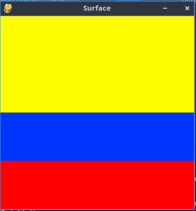

# Estructura de un juego en  Pygame

## Inicialización

- Como en todo programa en Python, se debe importar los módulos o librerias a utilizar
```import pygame```

- Inicializar pygame usando la función init(). Inicializa todos los módulos de pygame importados.
```pygame.init()```

## Visualización de la ventana

```ventana = pygame.display.set_mode((600,400))```

- set.mode() es la función encargada de definir el tamaño de la ventana. En el ejemplo, se està definiendo una ventana de 600 px de ancho, por 400 px de alto.

`pygame.display.set_caption("Mi ventana")`

- set_caption() es la función que añade un título a la ventana.

### Función set_mode

`set_mode(size =(0,0), flags = 0, depth = 0, display = 0)`

- size = (600,400) : define el tamaño de la ventana.

- flags: define uno o más comportamientos para la ventana.
    - Valores:
        - pygame.FULLSCREEN
        - pygame.RESIZABLE
    - Ejemplo:
        - flags = pygame.FULLSCREEN | pygame.RESIZABLE: pantalla completa o dimensiones de la pantalla modificables.

## Bucle del juego - game loop

- Bucle infinito que se interrumpirá al cumplir ciertos criterios.
- Reloj interno del juego
- En cada iteración del bucle del juego podemos mover a un personaje, o tener en cuenta que un objeto a alcanzado a otro o que se ha cruzado la línea de llegada, lo que quiere decir que la partida ha terminado.
- Cada iteración es una oportunidad para actualizar todos los datos relacionados con el estado actual de la partida.
- En cada iteración se realizan las siguientes tareas: 
    1. Comprobar que no se alcanzan las condiciones de parada, en cuyo casi se interrumpe el  bucle.
    2. Actualizar los recursos necesarios para la iteración actual.
    3. Obtener las entradas del sistema, o de interacción con el jugador.
    4. Actualizar todas las entidades que caracterizan el juego.
    5. Refrescar la pantalla.

    ## Superficies pygame
    - Superficie: 
      - Es un elemento geométrico.
      - Linea, polígono, imagen, texto que se muestra en la pantalla.
      - El polígono se puede o no rellenar de color.
      - Las superficies se crean de diferente manera dependiendo del tipo:
           - imagen: image.load()
           - texto: font.render()
           - Superficie genérica: pygame.Surface()
           - Ventana del juego: pygame.display.set_mode()

## Ejemplo: bandera de Colombia
```Python
# Importamos la librería pygame
import pygame
import random

# Inicializamos los módulos de pygame
pygame.init()

# Establecer título a la ventana
pygame.display.set_caption("Surface")

# Establecemos las dimensiones de la ventana
ventana = pygame.display.set_mode((400,400))

# Definimos un color
amarillo = (255, 252, 0)

# Crear una superficie 
amarillo_superficie = pygame.Surface((200,400))

# Rellenamos la superficie de azul
amarillo_superficie.fill(amarillo)

# Inserto o muevo la superficie en la ventana
ventana.blit(amarillo_superficie, ((0,0)))

# Definimos un color
azul = (0, 53, 255)

# Crear una superficie 
azul_superficie = pygame.Surface((400,200))

# Rellenamos la superficie de azul
azul_superficie.fill(azul)

# Inserto o muevo la superficie en la ventana
ventana.blit(azul_superficie, ((0,200)))

## Definimos un color
amarillo = (255, 252, 0)

# Crear una superficie 
amarillo_superficie = pygame.Surface((400,200))

# Rellenamos la superficie de azul
amarillo_superficie.fill(amarillo)

# Inserto o muevo la superficie en la ventana
ventana.blit(amarillo_superficie, ((0,0)))

# Definimos un color
rojo = (255, 0, 0)

# Crear una superficie 
rojo_superficie = pygame.Surface((400,200))

# Rellenamos la superficie de rojo
rojo_superficie.fill(rojo)

# Inserto o muevo la superficie en la ventana
ventana.blit(rojo_superficie, ((0,300)))

# Actualiza la visualización de la ventana
pygame.display.flip()

# Bucle del juego
while True:
    event = pygame.event.wait()
    if event.type == pygame.QUIT:
        break

pygame.quit()
```
